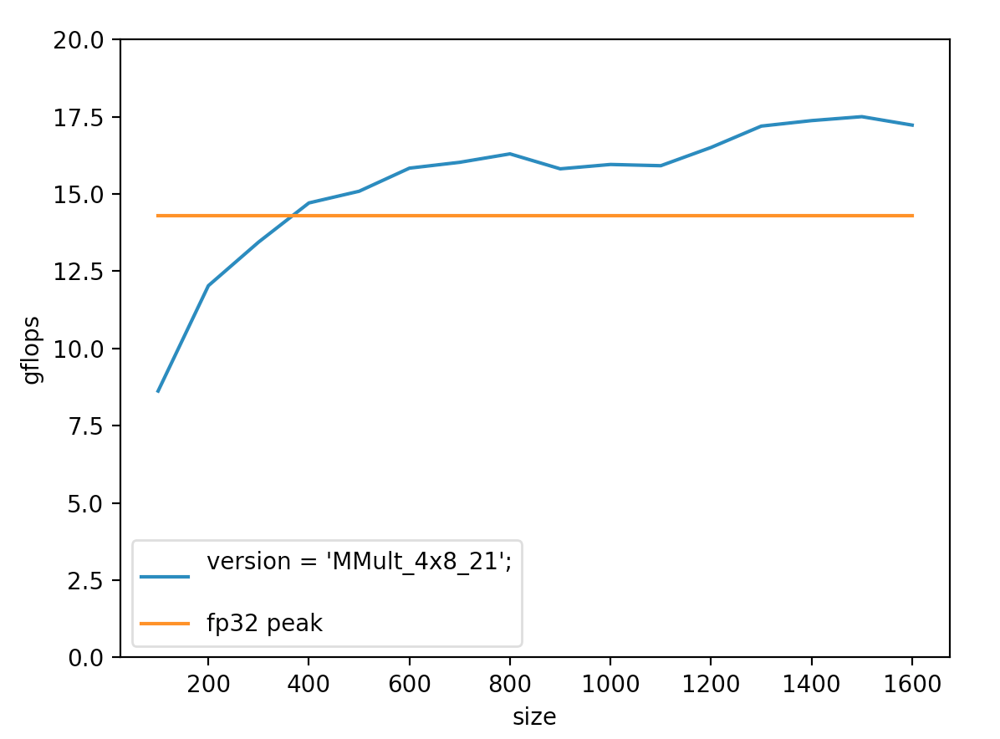

### chgemm

chgemm 是一个 int8 gemm 工程，与 BLAS gemm 不完全相同：

1. 输入为 [-127, +127] 范围内的 int8_t 类型矩阵，输出为 int32_t 矩阵。需注意溢出；
2. 更多地为深度学习应用场景考虑，packAB 接口暴露出来可以调整；
3. 实现为 C = A * B。alpha 和 beta 在深度学习推理中无实用意义；
3. 不低于其他项目的 symmint8 gemm 速度。

目前有个小 Bug，必须 -O0 编译...正在处理。

### 速度
-O0 编译，目前在 rk3399 单核结果。

目前极限可以到 17.5 gflops，橙线是 rk3399 单核 fp32 极限。 
